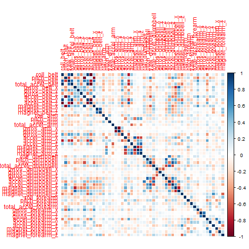
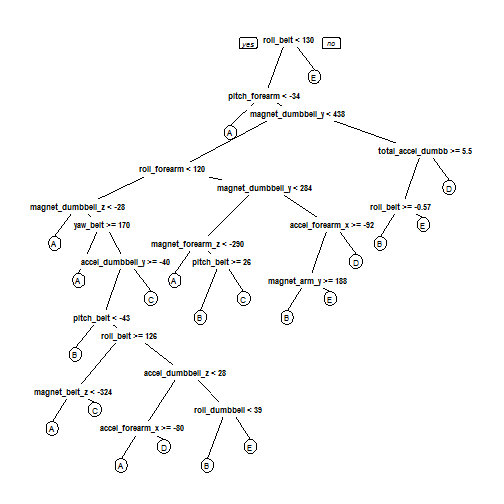

## Introduction


Using devices such as Jawbone Up, Nike FuelBand, and Fitbit it is now possible to collect a large amount of data about personal activity relatively inexpensively. These type of devices are part of the quantified self movement - a group of enthusiasts who take measurements about themselves regularly to improve their health, to find patterns in their behavior, or because they are tech geeks. One thing that people regularly do is quantify how much of a particular activity they do, but they rarely quantify how well they do it. In this project, your goal will be to use data from accelerometers on the belt, forearm, arm, and dumbell of 6 participants. They were asked to perform barbell lifts correctly and incorrectly in 5 different ways. More information is available from the website here: http://groupware.les.inf.puc-rio.br/har (see the section on the Weight Lifting Exercise Dataset). 

## Libraries Utilized in Analysis


```r
library(caret); library(rpart)
library(rattle); library(rpart.plot)
library(randomForest); library(RColorBrewer)
library(corrplot)
```

## Data Processing
### Data Importing and Dimension

```r
## importing in the training data file
train <- read.csv("./pml-training.csv")
dim(train)
```

```
## [1] 19622   160
```

Over a quick review of the data that will be utilized as the training and the cross validation data set, the number of variables consist of 160 with 19,622 observations.


```r
## finding the number of complete cases for analysis
sum(complete.cases(train))
```

```
## [1] 406
```

### Data Clean Up
Reviewing the data there were a total of 406 observations that were complete. In order to have data that is complete to build a model to predict the outcome, a function was created to clean up the data prior to the separation of the data sets.


```r
## column clean up function
cleanup <- function (x) {
        ## saves training data as an object
        data <- x
        ## pulls out the grades or "classe"
        grades <- as.data.frame(data[, max(length(data))])
        colnames(grades) <- "classe"
        ## filtering down to complete objects
        data <- data[, colSums(is.na(data)) == FALSE]
        ## function to remove unneeded columns
        remove <- function (x) {
                remove <- grepl("^X|timestamp|window", names(x))
        }
        ## applying the funciton
        data <- data[,!remove(data)]
        ## converting columns to numeric values
        data <- data[, sapply(data, is.numeric)]
        ## adding the grades or "classe" values back in
        data <- cbind(data, grades)
}
```

Applying the clean up function to the training data set. 


```r
## applying the cleanup function
train <- cleanup(train)
```

### Data Splitting

The data was split into to different sets: train and cross validation. Approximately 60% of the data went into the train data set, while the remaining 40% of the data went into the cross validation data set. 


```r
## setting the seed for reproducible purposes
set.seed(2015)
## creating training and cross validation data sets
inTrain <- createDataPartition(train$classe, 
                               p = 0.60,
                               list = FALSE)
        ## 60% of data goes into train data
train <- train[inTrain, ]
        ## remaining 40% goes into cross validation data
crossvalid <- train[-inTrain, ]
        ## removing the inTrain element
rm(inTrain)
```

## Building of The Model
### Training Data Set
Upon review of the data, the predictive model option that is used is the random forest option. This is to the robust power of selecting the important variables to help predict the outcome. In order to test the cross validation methods a five fold method was used in the training control method.


```r
## random forest model to predict the outcomes
model <- train(classe ~ ., data = train, method = "rf", 
               trControl = trainControl(method = "cv", 5), 
               ntree = 250)
model
```

```
## Random Forest 
## 
## 11776 samples
##    52 predictor
##     5 classes: 'A', 'B', 'C', 'D', 'E' 
## 
## No pre-processing
## Resampling: Cross-Validated (5 fold) 
## 
## Summary of sample sizes: 9421, 9423, 9420, 9420, 9420 
## 
## Resampling results across tuning parameters:
## 
##   mtry  Accuracy   Kappa      Accuracy SD  Kappa SD   
##    2    0.9868382  0.9833479  0.003312626  0.004194586
##   27    0.9887059  0.9857126  0.002521678  0.003191958
##   52    0.9803830  0.9751829  0.003313952  0.004190689
## 
## Accuracy was used to select the optimal model using  the largest value.
## The final value used for the model was mtry = 27.
```

### Cross Validation Data Set
The model was applied to the cross validation data set


```r
## predictions on the cross validation data
predictions <- predict(model, crossvalid)
confusionMatrix(crossvalid$classe, predictions)
```

```
## Confusion Matrix and Statistics
## 
##           Reference
## Prediction    A    B    C    D    E
##          A 1358    0    0    0    0
##          B    0  897    0    0    0
##          C    0    0  824    0    0
##          D    0    0    0  767    0
##          E    0    0    0    0  849
## 
## Overall Statistics
##                                      
##                Accuracy : 1          
##                  95% CI : (0.9992, 1)
##     No Information Rate : 0.2892     
##     P-Value [Acc > NIR] : < 2.2e-16  
##                                      
##                   Kappa : 1          
##  Mcnemar's Test P-Value : NA         
## 
## Statistics by Class:
## 
##                      Class: A Class: B Class: C Class: D Class: E
## Sensitivity            1.0000   1.0000   1.0000   1.0000   1.0000
## Specificity            1.0000   1.0000   1.0000   1.0000   1.0000
## Pos Pred Value         1.0000   1.0000   1.0000   1.0000   1.0000
## Neg Pred Value         1.0000   1.0000   1.0000   1.0000   1.0000
## Prevalence             0.2892   0.1911   0.1755   0.1634   0.1808
## Detection Rate         0.2892   0.1911   0.1755   0.1634   0.1808
## Detection Prevalence   0.2892   0.1911   0.1755   0.1634   0.1808
## Balanced Accuracy      1.0000   1.0000   1.0000   1.0000   1.0000
```

Checking the accuracy of the model's prediction.


```r
## checking the accuracy of the model
model.accuracy <- postResample(predictions, crossvalid$classe)
model.accuracy
```

```
## Accuracy    Kappa 
##        1        1
```

Checking the out of sample error. 


```r
## out of sample error
samp.error <- 1 - 
        as.numeric(confusionMatrix(
                crossvalid$classe, 
                predictions)$overall[1])
samp.error
```

```
## [1] 0
```

## Model's Application to Test Data to Predict Outcome
### Test Data Set Importing
Test data set was imported in. 

```r
## importing the test data
test <- read.csv("./pml-testing.csv")
dim(test)
```

```
## [1]  20 160
```

### Test Data Clean Up
The clean up function was slightly modified since no outcome is actually in data set.

```r
## clean up function is modify to remove the empty column
        ## where the classe was in the training data
cleanup <- function (x) {
        ## saves training data as an object
        data <- x
        ## pulls out the grades or "classe"
        data <- data[, -max(length(data))]
        ## filtering down to complete objects
        data <- data[, colSums(is.na(data)) == 0]
        ## function to remove unneeded columns
        remove <- function (x) {
                remove <- grepl("^X|timestamp|window", names(x))
        }
        ## applying the funciton
        data <- data[,!remove(data)]
        ## converting columns to numeric values
        data <- data[, sapply(data, is.numeric)]
}
```

Applying the data clean up function to the test data set. 
 

```r
## applying the revised clean up function to the test data
test <- cleanup(test)
```

### Model's Application to Test Data


```r
test$prediction <- predict(model, test)
test$prediction
```

```
##  [1] B A B A A E D B A A B C B A E E A B B B
## Levels: A B C D E
```

## Appendixes: 

1. Correlation Matrix
Note: The featured plot was generated but due to lack of visibility of the output another plot was selected. 

```r
## Correlation matrix of the data
## plot <- featurePlot(x = train, y = train$classe, plot = "pairs")
corrPlot <- cor(train[,-max(length(train))])
corrplot(corrPlot, method="color")
```

 

2. Decision Tree 
Note the fancy tree was slightly not readable. Another option was selected.

```r
## Decision Tree Plot
tree <- rpart(classe ~ ., data = train, method = "class") 
##fancytree <- fancyRpartPlot(tree)
basictree <- prp(tree)
```

 

